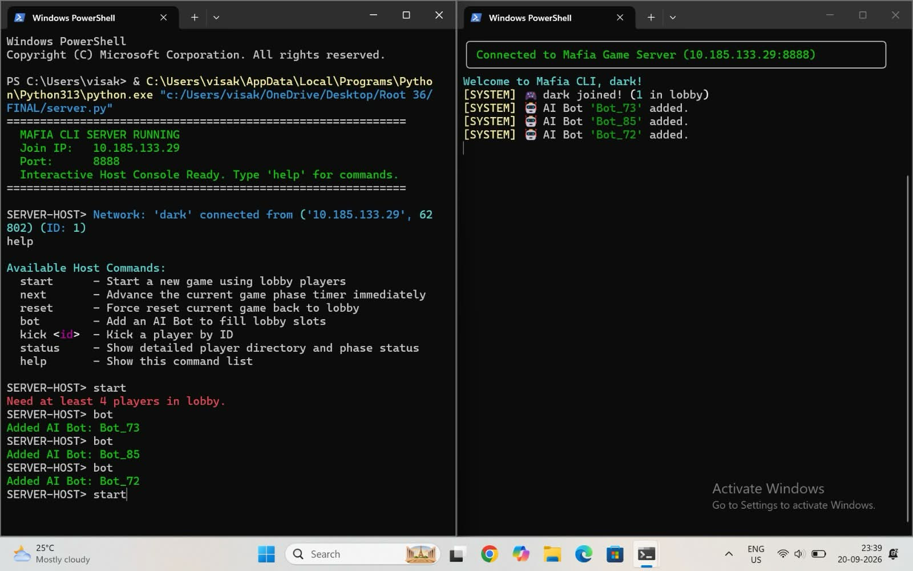
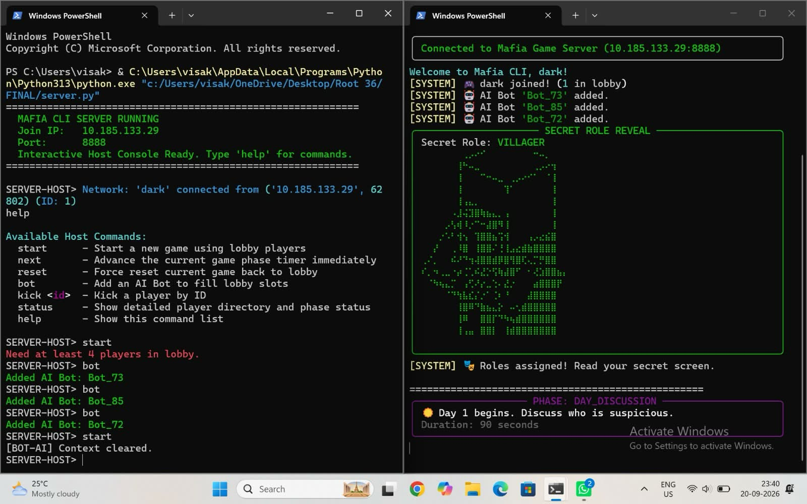
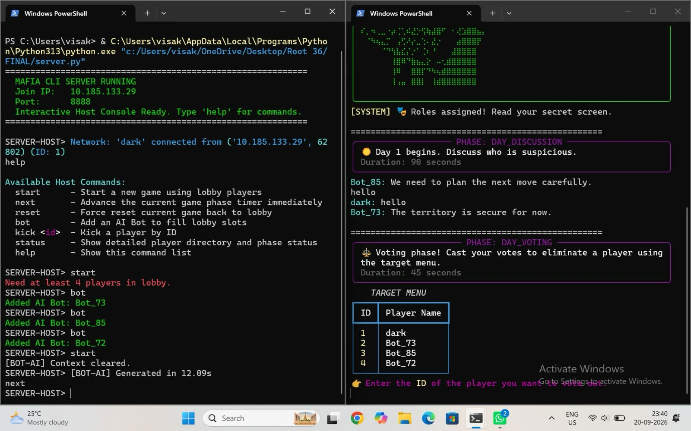
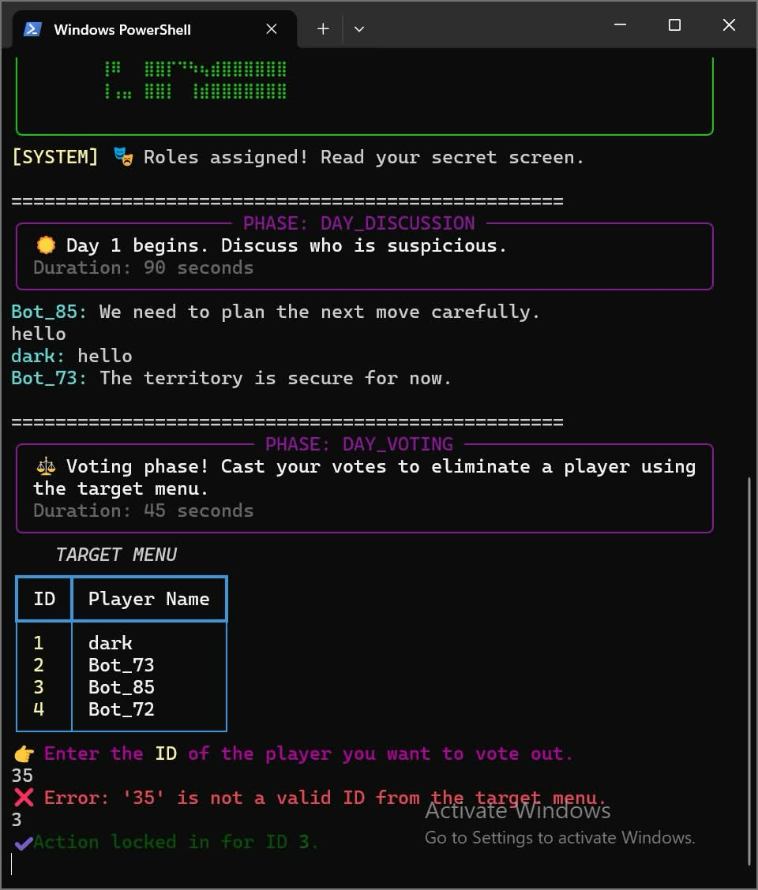
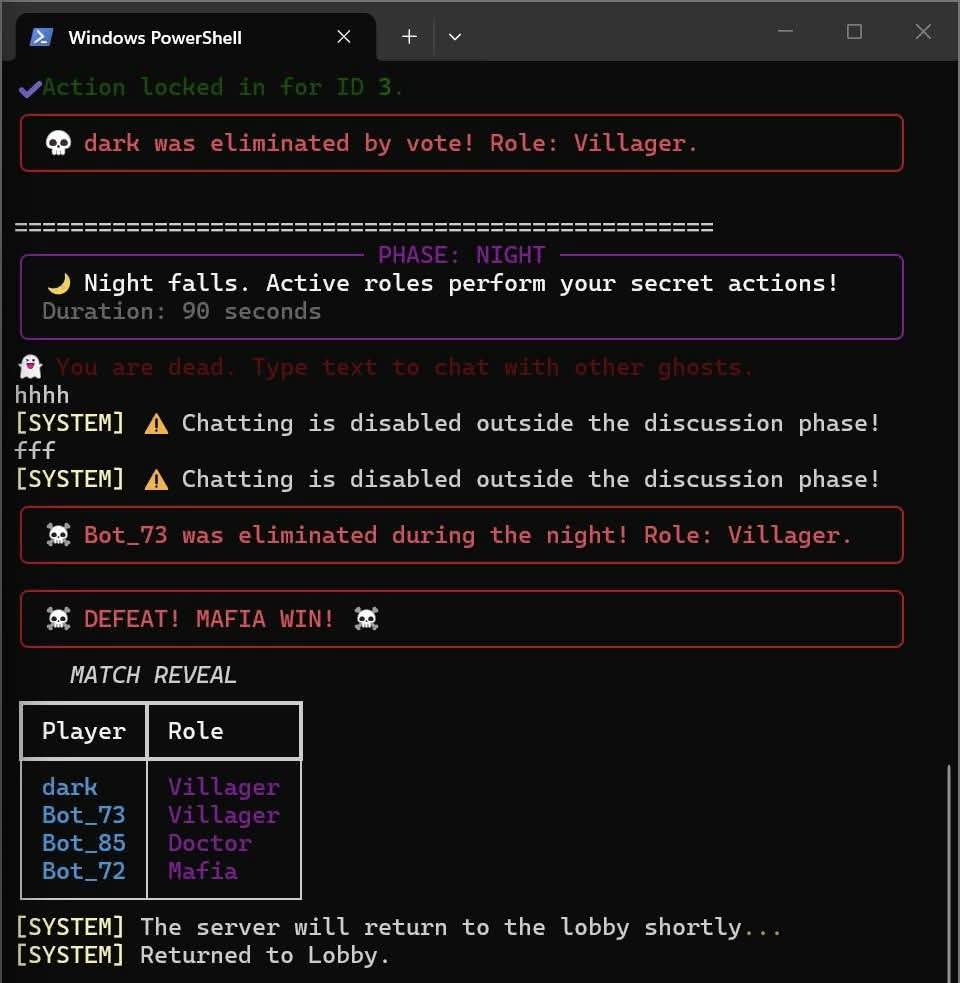
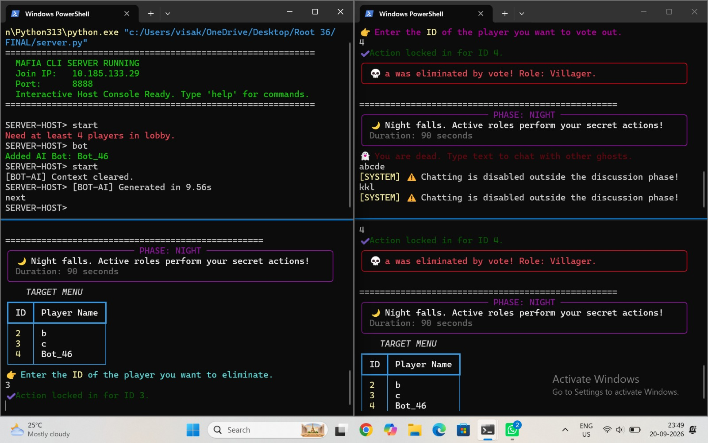
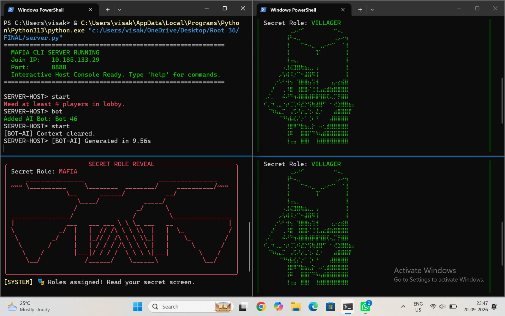
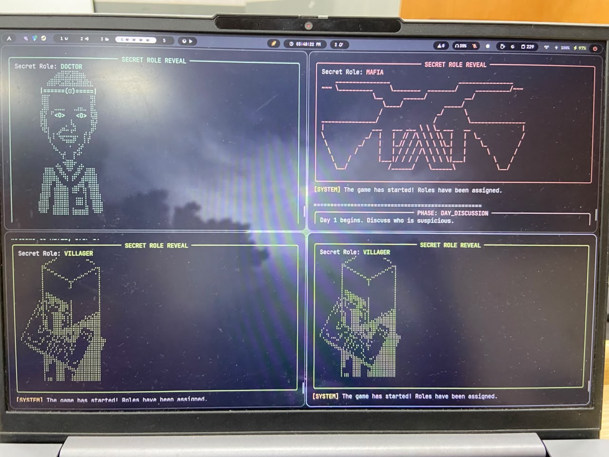

# 🎭 Larping Us

A CLI-based terminal mafia game for the Root36 Hackathon!
### Why the name "Larping Us"?
Larping is pretending to be someone you're not; in this case, we're pretending to be Among Us but we're not :D

## ⭐ Features

### Required Features
- Support for 4+ players with each player only being able to see their own role
- Structured game loop (our implementation: lobby -> game starts -> role assignment -> day/night cycle similar to Mafia)
- Fully playable via terminal input/output
- Handle player disconnection (/leave on client side)
- Clear win conditions for each side

### Additional Features
- Dead players are ghosts and can spectate the game
- Match summary on game end
- Voting results on a voting screen
- Special roles

## 🎮 Gameplay Showcase

   

   

   

   

   

   

   

   

## ℹ️ Requirements
- Python 3.0 or newer installed on your system
- [Ollama](https://ollama.com/download) with the `gemma4:e2b` model
- rich (for the terminal)
- pydantic (for structured outputs in Ollama native format)
- pygame (for audio playback)

## ⬇️ Installation & Running

- Clone the source code with `git clone https://github.com/nillinav/TerminalMafiaRoot36`.
- Download [Ollama](https://ollama.com/download) and run `ollama pull gemma4:e2b`.
- Run `pip install -r requirements.txt` in the terminal after going to the project directory.
### For the server
- The files `botai.py`, `game_state.py`, and `protocol.py` are required on the server side, along with `server.py`.
- Run `server.py`, preferably in the terminal with `python server.py`
### For the client
- The files `audio.py` and `protocol.py`, along with the folder `sound_effects` and its contents, are required on the server side, along with `client.py`.
- Run `client.py`, preferably in the terminal with `python client.py`

**NOTE:** The game is only playable on LAN, as per the requirements of this problem statement, so everybody has to be on the same network.